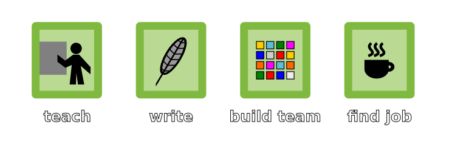

# Refactoring

Dr. Kristian Rother

[www.academis.eu](https://www.academis.eu)

----

## Agenda

- setup
- what is refactoring?
- find problems
- extract a module
- extract functions
- extract data structures
- extract a class

----

## Space Game - Setup

*planet images by [Justin Nichol](https://opengameart.org/content/20-planet-sprites) CC-BY 3.0*

    github.com/krother/refactoring_tutorial

### Run tests

    pip install pytest
    pytest test_space_game.py

### Play

    python space_game.py

----

## What is Refactoring?

Improve the structure of code without changing its functionality.

    Refactoring is like washing.
    It is most effective if repeated regularly.

### Generic Recipe

    1. run the tests
    2. improve the code
    3. run the tests

----

## Identify problems

Look for the following in `space_game.py`:

- long modules
- long functions
- duplications
- similar sections
- excessive indentation
- bad names
- mix of languages
- mix of domains (UI + business logic)
- too complex code
- code that you find hard to read

----

## Extract a Module

Move `TEXT` to a separate file.

1. create an empty Python file `text_en.py`
2. cut and paste the entire dictionary `TEXT`
3. add an import `from text_en import TEXT`
4. run the tests again

----

## Extract Functions

Make shorter functions out of long ones.

### Recipe

    1. select a code section
    2. name the function
    3. indent the code
    4. make a parameter out of every variable
       not created inside the function
    5. Add a return statement
    6. Add a function call
    7. Run the tests

----

## Exercise 1: display_inventory

Extract a function from the paragraph labeled **display inventory**.
Use the signature:

    def display_inventory(credits, engines, copilot)

This function does not need a return statement.

----

## Exercise 2: select_planet

Extract a function `select_planet()` from the last code paragraph in `travel()`.

* the function needs a single parameter
* the function needs a single return value

Work through the recipe.

----

## Extract and Modify

Extract a function `visit_planets()`. 
Use the signature:

    def visit_planet(planet, engines, copilot, credits, game_end):
        ...

and the function call:

    destinations, engines, copilot, credits, game_end = \
        visit_planet(planet, engines, copilot, credits, game_end)

**The tests should fail!**

----

## Fix the tests

Fix two problems:

The extra `return` statement in the black hole section).

Replace the `return` statement in the black hole section 
by `game_end = True`

Move the line printing end credits into the conditional branch where your copilot saves you.

----

## How small should functions be?

Uncle Bob (Robert C. Martin) states:

    Each function should do exactly one thing

    Q: When is a function doing exactly one thing?
    
    A: When you cannot make two functions out of it.

----

## Extract Data Structures

Convert the boolean variables: `copilot`, `credits`, `engine` and `game_end` into a data structure.

Define an empty set:

    flags = set()

Assign the posible flag values somewhere on top:

    copilot, credits, engine, game_end = range(4)

Change the `while` loop:

    while not game_end in flags:

Modify `display_inventory()`:

1. replace the function arguments by `flags`
2. modify the function call
3. to check state, use `if credits in flags:`

Modify `visit_planet()`:

1. replace the boolean arguments by `flags`
2. modify the function call
3. only return `planet` and `destinations`
4. modify the assigned return in `travel()`
5. to check state, use `if credits in flags:`
6. to modify state, use `flags.add('crystal_found')`

Run the tests.

----

## Extract puzzle functions

Decompose `visit_planet()` into further functions:

    if planet == "centauri":
        print(TEXT["CENTAURI_DESCRIPTION"])
        destinations = ["earth", "orion"]
        buy_hyperdrive(flags)

Do the same for the other puzzles:

    def star_quiz(flags):

    def hire_copilot(flags):

    def black_hole(flags):

Now `visit_planet()` should fit on your screen.

## Extract a dictionary

Place the destinations in a data structure:

    STARMAP = {
        'earth': ['centauri', 'sirius'],
        'centauri': ['earth', 'orion'],
        'sirius': ...,
        'orion': ...,
        'black_hole': ['sirius'],
    }

1. place the dictionary on top of the file
2. fill the missing positions
3. remove the `destinations` from `visit_planet()`
4. instead, return destinations with `return STARMAP[planet]`
5. run the tests

----

## More dictionaries?

Maybe we should extract the descriptions of each planet:

    PLANET_DESCRIPTIONS = {
        'earth': TEXT['EARTH_DESCRIPTION],
        'sirius': TEXT['SIRIUS_DESCRIPTION],
        ...
    }

Is this a good idea?

## Extract a Planet class

Define a new class `Planet`:

    class Planet:

        def __init__(self, name, description connections):
            self.name = name
            self.description = description
            self.connections = connections

### Add a method

Convert the function `visit_planet()` into a method:

    def visit(self, flags):
        print(self.description)

The tests will fail.

### Create instances

Create a dictionary of planets.

    PLANETS = {
        'earth': Planet(
            'earth', 
            TEXT['EARTH_DESCRIPTION'],
            ['centauri', 'sirius'],),
        ...
    }

Use the `Planet` instances in `travel()`:

    planet = PLANETS['earth']
    ...
    while ...:
        planet.visit(flags)
        display_destinations(planet)
        planet = select_planet(planet.destinations)

Run the tests and make them pass.

## Break down the visit function

There is still a block of `if` statements in `visit()`.

Add a puzzle attribute to `Planet.__init__()`

Use the puzzle functions as callbacks.

    'sirius`: Planet(
        'sirius',
        TEXT['SIRIUS_DESCRIPTION'],
        star_quiz)

Now in the `visit()` method, all you need to do is call the callback:

    if puzzle:
        puzzle(flags)

And the multiple `if` statements should evaporate.

----

## Notes

* names matter
* follow a clear paradigm (OOP, functional)
* use Design Patterns
* separate UI / business logic
* anticipate future change
* proceed in small iterations

In my experience, refactoring is much about executing a few standard techniques consistently.

You find a great list of refactoring techniques on [refactoring.guru](https://refactoring.guru/) by Alexander Shvets.

**Give it a try and have fun programming!**

----

## License

(c) 2022 Dr. Kristian Rother `kristian.rother@posteo.de`

MIT License